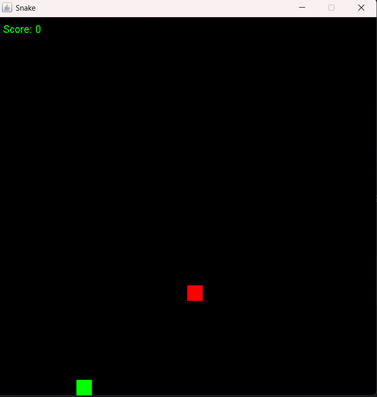
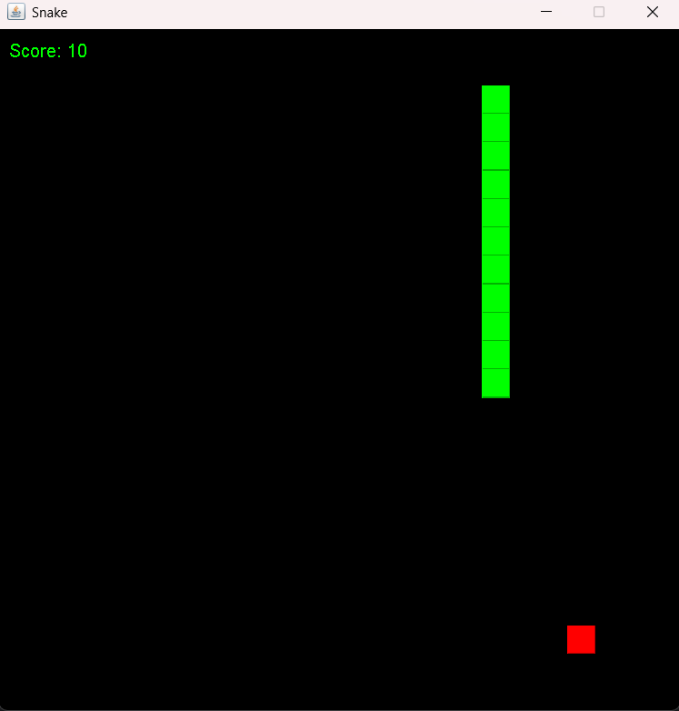
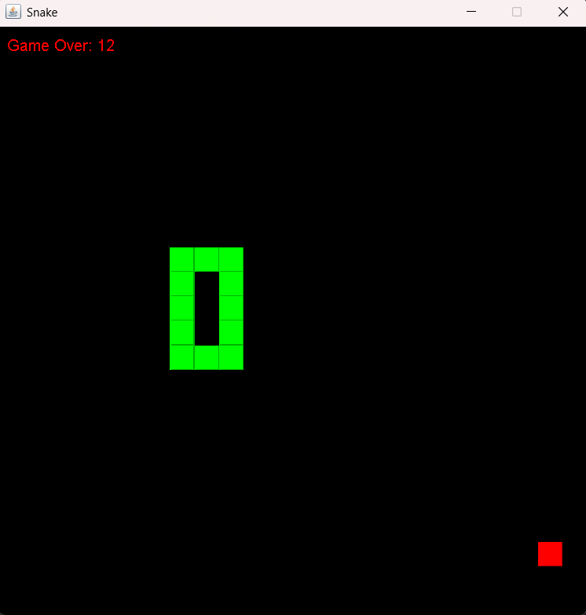

# Snake Game 🐍

This is a classic Snake Game developed in Java using the **Swing** library. The game is inspired by the traditional snake game where you control the snake to eat the food and grow longer while avoiding collisions with the snake’s body or the wall.

## Features

- **Responsive Controls:** The game uses arrow keys to control the movement of the snake.
- **Food Placement:** Food appears at random positions on the board for the snake to consume.
- **Score Tracking:** The score is calculated based on the number of food items consumed.
- **Game Over:** The game ends if the snake collides with its own body or hits the wall.
- **Simple GUI:** The game uses Java’s Swing framework for rendering graphics.
- **Resizable Board:** You can easily adjust the board dimensions by changing the values in the code.

## Demo

<p align="center">
 </p>

## Installation and Usage

1. **Clone the repository:**

   ```bash
   git clone https://github.com/your-username/snake-game-java.git
   cd snake-game-java
   ```

2. **Compile the project:**

   You can use any Java IDE like IntelliJ IDEA, Eclipse, or NetBeans. Alternatively, compile it manually using the following command:

   ```bash
   javac Main.java SnakeGame.java
   ```

3. **Run the game:**

   ```bash
   java Main
   ```

## Gameplay

- **Control Keys:**

  - **Arrow Up:** Move up
  - **Arrow Down:** Move down
  - **Arrow Left:** Move left
  - **Arrow Right:** Move right

- **Objective:** The goal of the game is to eat the red food to increase your score. The snake grows longer each time it eats the food.

- **Game Over:** The game ends when:
  - The snake collides with the wall.
  - The snake collides with its own body.

## Code Overview

### Main Class

- **Purpose:** Initializes the game window using Java's `JFrame`.
- **Functionality:**
  - Sets up the game window size, visibility, and termination operation.
  - Adds the `SnakeGame` panel to the frame and starts the game loop.

### SnakeGame Class

- **Purpose:** Handles the core game logic and rendering.
- **Attributes:**

  - **Tile Class:** Represents each segment of the snake and the food.
  - **Variables:** Manages game components like the snake, food, direction, score, and game-over status.

- **Core Methods:**
  - `draw(Graphics g)`: Renders the snake, food, and game-over screen.
  - `placeFood()`: Places food at a random location on the board.
  - `move()`: Handles the movement logic of the snake and checks for food consumption or collisions.
  - `collision(Tile tile1, Tile tile2)`: Checks for collision between two tiles.
  - `actionPerformed(ActionEvent e)`: Moves the snake and updates the game state at each timer tick.
  - `keyPressed(KeyEvent e)`: Captures keyboard inputs for controlling the snake.

## Screenshots

### Game Running

<p align="center">
 </p>

### Game Over Screen

<p align="center">
 </p>

---

## Requirements

- **Java Development Kit (JDK) 8 or higher**
- **Any Java IDE or text editor**

<!-- ## How to Contribute

Feel free to fork this project and submit pull requests to contribute to the development. You can add new features, fix bugs, or enhance the game’s UI. -->

<!-- ## License

This project is licensed under the MIT License - see the [LICENSE](LICENSE) file for details. -->

## Acknowledgments

- **Java Swing Documentation** for reference on creating GUI applications.
- Inspiration from the classic snake games we used to play on mobile phones.
